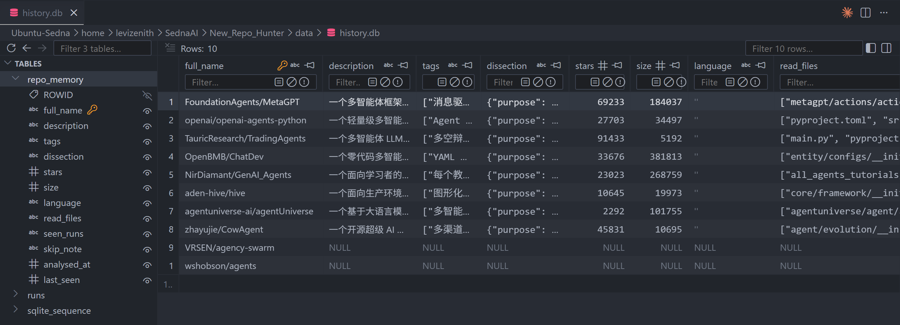
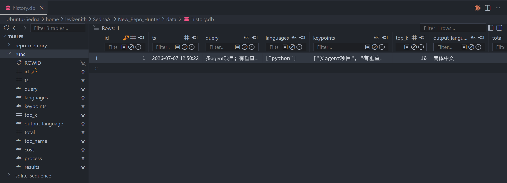

## Repo Detection

从用户需求到排序结果的完整流水线，按处理顺序分四个阶段：S1 把需求翻成查询并检索出候选池，S2 编判定标准、预抓资料、gate 粗筛方向，S3 读真源码出客观拆解，S4 逐条 keypoint 辩论裁决后排序。`content_filter.py` 是把 S2 到 S4 串起来的总编排，`pipeline.py` 再往外套一层、把 S1 也接上。实现细节看各文件 docstring，本文档只管地图和路线。

```text
hunter/
├── pipeline.py                       # run_pipeline：串联 QU → keypoint 编译 → 检索 → Repo_Detection
├── config.py                         # 密钥、各阶段模型名、隆目录、load_skill
├── cost.py                           # token 计量：COST 按阶段汇总 + TokenMeter 盯单条调用链
├── clients.py                        # GitHub MCP 连接封装，检索阶段用它搜仓库
├── pre_filter/                       # S1、S2 的文件
│   ├── query_understanding.py
│   ├── keypoint_understanding.py
│   ├── repo_languages.py
│   ├── search_repo.py
│   └── skills/
│       ├── query_understanding.md
│       └── keypoint_understanding.md
├── repo_detection/                   # S2、S3、S4 的文件
│   ├── content_filter.py
│   ├── prefetch.py
│   ├── agent_tools.py
│   ├── tool_loop.py
│   ├── log_visual.py
│   ├── explorer.py
│   ├── audit.py
│   ├── evidence.py                  # 按分诊清单从克隆里抠符号周围源码，拼成按需证据
│   ├── debate.py
│   ├── scoring.py
│   └── skills/
│       ├── system_header.md
│       ├── skip_gate.md
│       ├── content_filter.md
│       ├── triage.md                # 分诊：判拆解够不够判这条 keypoint，不够就开取证清单
│       ├── advocate.md
│       ├── skeptic.md
│       └── adjudicate.md
├── history/                          # 搜索侧记忆：仓库账本 + 搜索账本，两表一库
│   ├── history_db.py
│   ├── repo_memory.py
│   └── runs.py
├── memory/                           # 对话侧记忆（S3，占位休眠）
└── chat/                             # 占位桩（未迁移，休眠）
```


### S1 QU & Repo Search

用户的需求清单进来，抽出 GitHub 能搜的查询词，语言字段纠错归一后当硬过滤，检索去重出候选仓库池。

按序读三个文件：

1. `pre_filter/query_understanding.py`：调模型从需求清单抽搜索查询，keypoints 原样带回不改写；输出 JSON 坏掉走修格式重试、正则抠取、空壳兜底三级。skill 在 `skills/query_understanding.md`。
2. `pre_filter/repo_languages.py`：语言名三级归一（别名、精确、模糊），两字母以内不走模糊防错纠；Python 和 Jupyter Notebook 绑成一对同搜。
3. `pre_filter/search_repo.py`：每条查询剥引号合成单条 OR 组（带引号短语和 OR 混用 GitHub 会静默返回零结果），拼上语言、归档、fork 限定并发搜，按仓库全名并集去重。


### S2 Pre-Filter

深挖前的三样准备：把每条 keypoint 编译成一句可判定的标准，让所有仓库用同一把尺子；预抓 gate 和后续角色要看的资料；gate 只看资料判整体方向，明显不符的软跳过（置灰沉底不淘汰，拿不准一律放行）。

按序读三处：

4. `pre_filter/keypoint_understanding.py`：每条 keypoint 独立并发编译成一句判定标准，单条失败给空串不挡流程。skill 在 `skills/keypoint_understanding.md`。
5. `repo_detection/prefetch.py`：走 GitHub API 预抓三样：README（按标题砍掉 changelog、license 等噪声段再截断）、两层目录树、stars 和体积。体积拼进 system 给模型判体量，防 README 自称轻量误判。
6. `repo_detection/explorer.py` 里的 `_call_gate`：不带工具的一次调用，只看预抓资料判 skip 还是 proceed，解析失败默认放行（错跳不可逆）。skill 在 `skills/skip_gate.md`。


### S3 Content Filter

gate 放行的仓库浅克隆到本地，explorer 拿四个只读工具循环读真源码，产出一份不含任何 keypoint 的客观架构拆解（目的、技术栈、带锚点的关键设计、架构总览）。拆解里每个锚点由代码对克隆核验，对不上先打回让模型重修一次，仍对不上删点兜底。

按序读五个文件，先工具后主循环：

7. `repo_detection/agent_tools.py`：四个只读工具的后端（列目录、读文件带行号和已读缓存、ripgrep 正则搜索、按文件名找文件）加发给模型的工具清单，全部对本地克隆操作。
8. `repo_detection/tool_loop.py`：explorer 和辩论共用的循环底件：解析模型输出 JSON 带兜底、执行单个工具调用并兜错、拦截重复读 README 和根目录。
9. `repo_detection/explorer.py`：全篇核心。主循环每轮把工具摆给模型，模型调工具就执行回灌进下一轮，不调了这轮回复就是最终拆解；工具预算二十次用满逼停，半程和停滞各注入一次提醒。skill 在 `skills/content_filter.md`，共享 system 模板在 `skills/system_header.md`。
10. `repo_detection/audit.py`：锚点审计与自愈：逐个核对拆解里的文件路径和符号真实存在，坏的拼成重修指令打回，重修后仍坏的删掉；辩论论据的锚点也走同一套核验。
11. `repo_detection/log_visual.py`：Visual 和 ReAct 两种日志格式化，不影响主线，扫一眼即可。


### S4 Debate & Adjudicate

拆解出来后，keypoint 判定走辩论：每条 keypoint 一条独立链路，正反两个带工具的 worker 并行取证（正方找支持证据、反方找反证），锚点核验后交一个上下文干净的裁决者判 hit 或 miss。所有链路整体并发，判定结果按下标对齐回清单，最后按命中数排序。

按序读两个文件：

12. `repo_detection/debate.py`：单个立场 worker 的小号工具循环（预算四次）、正反和裁决三方的 prompt 填充、强制 JSON 的裁决请求。skills 在 `advocate.md`、`skeptic.md`、`adjudicate.md`。
13. `repo_detection/scoring.py`：判定按位置对齐回发出的清单（不靠模型照抄原文），漏判补 miss；数命中数不算分不设及格线；排序按命中数降序、平手比 stars，跳过和降级的沉底。


### S4 取证重构：先分诊，按需读码

现在的辩论让正反两方各自跑去仓库里翻源码找证据，同一批文件被两方、被多条需求反复读，读来的内容又因为每个 worker 的对话开头都不一样、缓存互相不认，全按原价重算。结果本该最重的读源码阶段（S3）反被辩论阶段的开销盖过。

重构的思路是把「翻代码」这件事从辩论方手里收回来，交给代码按需去做，辩论方只管判断。每条需求（keypoint）走三步：

- **分诊**：一次中立的调用，不站正反任何一方。给它看这个仓库的拆解和这一条需求，它只回答两件事，手上的拆解够不够判这条需求、不够的话要看哪几个文件或符号。够判就直接进辩论，一行源码都不用读。
- **按需取证**：纯代码的活，不花模型调用。拿分诊开出的清单，去本地克隆里把对应的那几段源码抠出来。抠的是一个符号（某个类或函数）周围的一小段，不是整份文件，所以即便命中一个几千行的大文件也只取那一小块。
- **判决**：正反两方拿到同一份材料（拆解加按需抠出的源码）各表一次态，一个上下文干净的裁决者收口，判这条需求 hit 还是 miss。

分诊开出的清单要过几道兜底关卡，因为它的输出是要拿去读文件的，不能全信模型：

- 清单里每一项指向的文件路径和符号，都先对本地克隆核一遍真实存在，对不上的直接丢（模型偶尔会编路径）。
- 一次最多抠几段、抠出来的总量有字数上限，防止一条需求就把源码整本搬进来。
- 清单被兜底关卡砍光、或者分诊的回复格式坏掉解析不出，都退回「只用拆解判」这条路，不让任何一步卡死整条链。模型说的「够」或「不够」只当参考，代码只认清单里真正兑现了的那几段。

举两条需求对比：

- 需求「必须是多 agent」。拆解的关键设计里已经写明「agents 目录下有 12 个不同角色，由一张图统一编排」，分诊判够，正反方直接就着拆解辩，不读源码。
- 需求「项目自带可下载的数据集」。拆解只讲了架构、没提数据，分诊判不够，开清单要看数据目录。代码把那个目录的内容抠出来，发现只有一个下载脚本、没有真实数据文件，反方据此判 miss。

省钱还是靠共享缓存，而且比原来省得多。仓库的资料页和拆解挂在所有调用共同的开头，一份只算一次钱；每条需求按需抠的那几段源码是它自己独有的，只抠一次，给这条需求的正反两方共用。够判的需求连源码都不抠，只花分诊那一次的思考钱。

skill 层面：新增一个分诊 skill；正反两方的 skill 改掉，不再给它们工具，改成基于给定材料评估；裁决 skill 不变。

### 完整运行逻辑

需求清单和语言过滤进来，Query_Understanding 翻成搜索查询（keypoints 原样带回），Keypoint_Understanding 给每条编一句判定标准，语言归一后拼进硬过滤，Search_Repositories 并发搜出去重候选池。

候选池交给 Repo_Detection，所有仓库并发跑，单仓库内部：prefetch 抓 README、目录树、stars/size 拼成六样资料页 system；gate 只看资料页判方向，跳过的直接出结果沉底；放行的浅克隆到本地，explorer 工具循环读源码出拆解、过锚点审计；然后按 keypoint 扇出，每条一对正反 worker 并行取证、核锚点、立刻单条裁决。全部跑完 scoring 按命中数排序。

省钱主线是 DeepSeek 前缀缓存：同一仓库的 gate、explorer、正反方四次调用共享逐字节相同的资料页 system，README 那三千多字只真算一次钱；多轮循环只往消息末尾追加、绝不改写历史，每轮前缀都完整命中。

搜索侧记忆已经接活：查记忆命中且存过拆解的仓库跳过 explorer 直接复用，没命中的照常深挖，搜完一次写回两张表。对话侧记忆（S3）仍休眠。地图见下一节。


---


## Memory

记忆板块的完整数据流：两条写入路径喂三个库，对话侧再把存的东西读回来用。

```text
【搜索侧】写 history.db
  用户 query
    └─> pipeline：QU → 检索 → gate → explorer 拆解 → 辩论 → 排序
          │   use_memory 开着时，命中有拆解的仓库就跳过 explorer 直接复用（load_memories）
          └─> save_run 一次写两张表
                ├─ repo_memory：一仓库一行，贵拆解全库只存一份 + seen_runs 搜索时间线
                └─ runs：一次搜索一行，轻量增量（判定/trace/token）只留 full_name 指向 repo_memory

【对话侧】读 history.db + 读写 memory.db
  用户消息 + 手动「+」注入的仓库(wsContext)
    └─> build_segments 拼 system：
          ① 人设(llm_skill)
          ② 通用记忆索引：list_general 取 user/feedback/project/reference 四类，
             每条压成一句摘要 +「N 天前」，正文不进上下文
          ③ 注入仓库：get_memory 取拆解 + list_by_repo 取该仓库聊过的 repo 类事实
          ④ 召回 select_from_manifest（每轮先跑一次小模型）：
               清单 = repo_memory(有拆解·未注入) + 四类通用记忆，每条 name + 一句描述
               跳过门：消息不足 4 字 或 纯应答(「嗯」「好的」) → 不调小模型
               小模型按语义挑三档：
                 picks·仓库  → 补全量拆解，右栏冒出「召回」芯片转正、往后常驻
                 picks·记忆  → 把正文补进「召回的记忆」段
                 ambiguous   → 补候选清单，助手反问用户是哪个
               每次判断 → dev.record（落监控）
    └─> stream_chat：system + 对话历史 → DeepSeek 流式 → delta 逐字上屏
          ├─ 每轮吐 prompt 事件(分段) → 点头像看提示词+召回判断，分段随会话存库(退出重进还在)
          └─ 聊完 spawn_extraction（后台任务，不阻塞回答、失败不影响对话）
                └─> 提取，写 chat_memories
                      触发：新消息攒够 12 条(6 轮) 或 用户说「记住」
                      读游标 → 只取新消息(增量) → 调模型 → 密钥扫描打码
                      → repo 类校验 full_name 真伪(编的丢) → apply_actions 落库
                      → 落成功才挪游标；单飞 + 补跑，同时只跑一个不撞车
                      产出五类：user/feedback/project/reference(四类通用) + repo(带锚点)
                        四类通用 → 下次任何对话进索引、被召回补正文
                        repo 类  → 跟对应仓库的拆解一起注入
  会话本身 → save_session → chat_sessions（messages 含每轮的提示词分段）

【监控】横切，不碰主流程，开关默认关
  召回判断 + 提取过程 → dev.record → dev_audit.db → 前端 🔬 审计视图（落库，重启仍在）

【三个库】
  data/history.db    repo_memory(拆解一份) + runs(每次搜索)
  data/memory.db     chat_sessions(会话 + 提示词分段) + chat_memories(提取的记忆)
  data/dev_audit.db  dev_records(召回 / 提取监控)

【闭环】
  搜索侧存的拆解 → 对话侧注入或召回时读回来答题
  对话侧提取的记忆 → 下次对话进索引、被召回补回上下文
```

原来「仓库记忆」和「搜索历史」是两个库、信息高度重复（同一份拆解每次搜索各抄一份），已合并成一个库两张表，用 full_name 挂钩、拆解全库只存一份。存储落在 `data/history.db`。

```text
hunter/history/                       # 搜索侧记忆的代码
├── __init__.py                       # 门面：两个子模块的对外函数
├── history_db.py                     # 共享 history.db 连接（DB_PATH + _connect + now_str）
├── repo_memory.py                    # 仓库账本：一仓库一行，拆解只存一份
└── runs.py                           # 搜索账本：一次搜索一行，拆解指向 repo_memory

data/history.db                       # 搜索侧的库，repo_memory 和 runs 两张表都在这
```

对话侧（S2 聊天 + S3 记忆）另起两个包和一个库，各节自己的树里画：`hunter/chat/` 管对话循环，`hunter/memory/` 管对话侧存储和提取，都连 `data/memory.db`，跟搜索侧的 history.db 彻底分开。


### S1 Repo 记忆

只存事实、存到拆解为止：拆解对任何未来搜索有效，全库存一份；hit/miss、辩论结论绑定当次需求，按次留在搜索账本。静态假设，拆解一次终身有效，不做过期。被 gate 跳过的仓库也占一行只记跳过原因。复用发生在召回之后，命中有拆解只跳 explorer，gate、克隆、辩论照跑，事实拿现成的、判断重新做。记忆开关只挡读不挡写，关一次也不漏存。

两张表分工：**仓库账本**一仓库一行，存跨搜索不变的贵拆解（全库一份），seen_runs 记这仓库被哪几次搜到过的摘要当审计时间线；**搜索账本**一次搜索一行，results 里每个仓库只留那次的轻量增量（判定、trace、tokens），拆解不抄、只留 full_name 指向仓库账本，回放时 JOIN 回来。

按序读三个文件：

1. `history/history_db.py`：数据库其实就是磁盘上一个文件 `data/history.db`，读写它得先打开、建一条通道（叫连接），完事关掉。`_connect` 就负责打开这个文件、返回一条连接，两张表都来这里拿，不各写一遍。时间戳也在这统一：`now_str` 出「2026-07-07 12:50:22」这种可读格式，两张表的时间列都用它，开库直接看得懂。

2. `history/repo_memory.py`：仓库账本，管拆解的存取。
   - `upsert_repos`：搜完把这批仓库写进来，分四种情况：
     - 头回见新建
     - 已存过拆解只往 `seen_runs` 时间线追一笔
     - 上次跳过这次拆了就把拆解补上
     - 这次没拆只记一笔。
   - `load_memories`：搜索侧拿一批仓库名查回谁有拆解，命中就跳 explorer。
   - `get_dissections`：搜索账本回放时按名字捞拆解。
   - `list / get / delete / clear`：撑前端仓库页。
   
3. `history/runs.py`：搜索账本，管每次搜索的流水账。
   - `save_run`（唯一写入口）：先插一行搜索拿 `run_id`，把每个仓库里重复的拆解摘掉、只留仓库名指向仓库账本，再回调 `upsert_repos` 写仓库账本。
   - `get_run`：回放时把拆解按名字 JOIN 回来拼成完整结果，仓库删了那格给空、不报错。
   - `list / delete / clear`：撑前端历史页。

接入点都在搜索侧：`repo_detection/content_filter.py` 用 load_memories 查记忆、命中的把拆解传给 explore_one 跳过 explorer（use_memory 开关只挡这步读），`pipeline.py` 搜完调 save_run 一次写两张表（不受开关影响），`webapp/backend/server.py` 启动调 init_runs + init_repo_memory 建表，/history 五个路由走搜索账本、/memory 四个路由走仓库账本。


> **示例：输入 keypoints 查询「多agent项目 / 有垂直领域应用 / 架构里有 agent ReAct 循环」，跑完 `save_run` 一次写两张表。**

仓库账本 `repo_memory`：

- 这次召回的十个仓库各占一行
- `dissection` 存着二十次工具换来的架构拆解，是最贵的东西、全库只此一份
- `stars / size / language` 是仓库元数据
- `seen_runs` 记着这仓库被哪几次搜到过（run_id、时间、那次 keypoints、命中几条）
- `analysed_at / last_seen` 是可读时间。




搜索账本 `runs`：这次搜索本身占一行，`keypoints / languages / top_k / cost` 是这次搜索的元数据，`results` 里每个仓库只留那次的判定、轨迹、token 这些按次不同的轻量增量，只留 `full_name` 指回上面那张表；`ts` 也是可读时间。



同一个仓库的贵拆解只在 `repo_memory` 存一份，`runs` 每次搜索只记那次的轻量账、**用仓库名指向 `repo_memory` **，不重复写入。回放某次搜索时 `get_run` 按名字把拆解 JOIN 回来拼全。


### S2 聊天模块

工作台右栏的对话。用户在结果卡点「+」把仓库注入右栏，问它问题，助手带着这些仓库的拆解流式回答。这是对话的最小版，只答已知：注入的仓库，以及 history 里存过拆解的仓库。

边界：对话和搜索完全解耦，对话不能触发搜索。搜一次是几百次模型调用的重活，不能被一句闲聊意外点火。没分析过的仓库，助手直接回「这个我没分析过，去搜索页跑一次」，绝不代替用户开搜索。会话存进对话侧的库 `data/memory.db`，聊完能在会话列表里翻看、点开还原。

```text
hunter/chat/
├── __init__.py                  门面：导出 stream_chat
├── context.py                   拼 system：人设 + 注入仓库的拆解
├── session.py                   对话主循环：流式调模型、吐中性事件
└── skills/llm_skill.md          助手人设与边界纪律

hunter/memory/
├── memory_db.py                 共享 memory.db 连接
└── chat_history.py              chat_sessions 表：一会话一行存完整对话

data/memory.db                   对话侧的库，会话存这
```

按序读五个文件：

1. `chat/skills/llm_skill.md`：助手的人设和纪律，规定它是谁、怎么答、边界在哪（不触发搜索，没分析过的仓库让用户去搜索页）。纯提示词，先读它就知道这个助手被设成什么样。

2. `chat/context.py`：拼给模型的开场资料（system）。加载人设，再把用户「+」注入的每个仓库的拆解从 history 仓库账本（`get_memory`）取出来。拼的时候不揉成一坨，而是拆成带标签的段，人设一段、每个仓库一段（标签是仓库名）；发给模型时拼成整串，分段结构留给下面的提示词监控。没注入的仓库助手看不到。

3. `chat/session.py`：对话主循环。`stream_chat` 拿着对话历史和注入的仓库名单，让 context 拼好 system，流式调 DeepSeek，边收边吐中性事件（一个字一个 delta、答完一个 done、出错一个 error），webapp 那层把这些包成 SSE 推给前端。每轮开头还额外吐一个 `prompt` 事件，带上 system 的分段和这轮消息，给提示词监控用。

4. `memory/memory_db.py`：对话侧的共享连接，连 `data/memory.db`。跟搜索侧的 history.db 分开，一个记对话、一个记搜过的仓库，各清各的互不牵连。角色跟 history_db.py 一样。

5. `memory/chat_history.py`：chat_sessions 表，一个会话一行，存这次对话从头到尾的完整消息。
   - `save_session`：upsert。同一会话再聊一轮，前端把完整快照发上来、整行覆盖；点新对话换个 session_id 就新插一行。
   - 会话 id 用创建时间戳（如 `20260703-1522`），一眼看出啥时候开的、也能排序。
   - `list / get / delete / rename / set_pinned`：撑会话列表的显示、还原、删除、改名、置顶。

接入点大多已就位：server 的 `/chat` 路由已 import `stream_chat`，`/chat/session` 五个路由已 wired 到 `memory.*`，前端聊天 UI、会话列表、session_id 生成都现成，占位换真、session_id 改成时间戳即可。

示例：

- 用户把 TradingAgents 点「+」注入，问「反思怎么实现的」。context 把 TradingAgents 的拆解拼进 system，模型带着拆解流式答出实现细节。聊完 `save_session` 把这轮存进 chat_sessions，会话列表里能看到、点开能还原。
- 用户又问「langgraph-supervisor 怎么样」，这仓库没搜过、history 里没有。助手直接回「这仓库我没分析过，去搜索页跑一次」，不发起任何检索。

提示词监控：点对话框里 agent 的头像，展开看这一轮真正发给模型的完整提示词，按板块分色。前端存下每个会话最近一次的 `prompt` 事件，点头像就按块渲染，人设、每个注入仓库、user 消息、assistant 消息各配一个固定颜色。注入的每个仓库拆解单独一块，一眼看清这轮给模型喂了什么。


---


### S3 记忆提取

每聊完一段，后台自动把对话里「值得长期记住、又没法从项目现状推导」的东西提炼出来存进记忆库，下次对话自动带上。存五类：user / feedback / project / reference / repo（关于某个具体仓库的事实，带锚点）。

S3 压在 S2 建好的地基上：`memory_db.py`（对话侧连接）和 `chat_history.py`（chat_sessions 表）都是 S2 的，S3 直接用，只在 chat_sessions 上加一列 `extract_cursor` 记提取到第几条了，再新建一个 `extract/` 子包和一张 chat_memories 表。

```text
hunter/memory/
├── memory_db.py                 （S2 已建）共享 memory.db 连接
├── chat_history.py              （S2 已建）chat_sessions 表；S3 在它上面加一列 extract_cursor
└── extract/                     S3 新建
    ├── __init__.py
    ├── secret_scan.py           落库前密钥扫描打码
    ├── chat_memories.py         chat_memories 表：按 action 落库 + 各种查 + 游标存取
    ├── extractor.py             提取编排：攒轮触发、调模型、校验、落库，同时只跑一个不撞车
    └── skills/extract_memories.md

data/memory.db                   对话侧的库：S2 的 chat_sessions 表 + S3 新加的 chat_memories 表
```

按序读 S3 新增的三个文件：

1. `extract/secret_scan.py`：密钥防线。`scan_and_redact` 拿一段文本，用一组高置信度前缀正则（sk-ant、ghp_、AKIA 那些）扫，命中就换成 `[REDACTED]`。每条要落库的记忆正文先过它，防对话里贴的 API key 被存进库。
2. `extract/chat_memories.py`：管 chat_memories 表，一条记忆一行。
   - `apply_actions` 把模型返回的动作落库（add 插、update 按 name 找行覆盖、delete 按 name 删）。
   - `list_general` 取四类通用记忆（user、feedback、project、reference，注入时全量带上）
   - `list_by_repo` 按仓库取 repo 类
   - `list_manifest` 列已有记忆的名字加描述（提取前给模型防重复）
   - `get/set_extract_cursor` 读写 chat_sessions 上那列游标

3. `extract/extractor.py`：编排。`spawn_extraction` 每轮聊完起个后台任务，攒够 12 条新消息（6 轮）或用户说「记住」才真跑，一次提取按顺序走：
   - 读游标只取新增消息，拼上已有记忆清单发给模型，拿回 JSON 动作。
   - repo 类的 full_name 去 history 仓库账本核真假、编的丢；每条正文过密钥扫描。
   - `apply_actions` 落库。
   - 落库成功才把游标挪到最新（失败就不挪、下次从老位置重来，不漏）。

   另外有一条防并发的规矩，用大白话讲就是：同一时刻只让一个提取在跑，别让两个同时往记忆库里写、打架。如果一个提取正跑着、这时你又聊完一轮触发了新的，它不插队开第二个，而是先记一个「待办」；等当前这个跑完，再补跑一次把待办里新聊的那段处理掉。这样既不会两个撞车，也不会漏掉最后那轮。


**存储逻辑（记忆在库里怎么摆）**：所有提取出的记忆全存进同一张 chat_memories 表，不分 session 建表。每行有一列 session_id 记它出自哪次对话，这列只是审计元数据，用来查「这次对话产出了哪些记忆」（`list_by_session`，给开发者面板看）。

真正用起来是跨 session 的：四类通用记忆每次对话全量注入，不管它当初在哪个 session 提取的；repo 类按仓库名注入。所以助手在一个全新会话里也知道你在别的会话说过的偏好，这正是记忆的意义。

去重也是全局的，记忆按 name 唯一，两次对话提出同名记忆后一次 update 覆盖前一次；提取前给模型的已有清单也是全库的，防跨 session 重复。一句话：**存一起、session_id 只当审计标签、召回全程跨 session。**

会话 id 直接用对话创建的时间戳（如 `20260703-1522`），不用随机串，一眼看出这次对话是什么时候开的、也天然可排序。chat_memories 的 id 是内部自增行号、不带含义，一条记忆真正的身份是它的 name；下面示例只看有意义的列。

示例：一条记忆怎么跨会话被用上。

第一步，7 月 3 日下午开了个对话（会话 `20260703-1522`）。你注入 TradingAgents、问它反思怎么实现，来回聊了 6 轮。攒够 6 轮，后台提取触发：它从这 6 轮里抠出一条关于 TradingAgents 的事实，落进 chat_memories。落库前先去 history 仓库账本确认真有这仓库、再扫一遍没夹带密钥。模型返回的就是这一条：

```json
{"action":"add","type":"repo","name":"tradingagents-reflection",
 "description":"TradingAgents 反思机制的实现方式",
 "content":"反思用轻量模型对已结算决策生成反思文本，追加进决策日志",
 "full_name":"TauricResearch/TradingAgents","where":"tradingagents/graph/reflection.py:Reflector"}
```

第二步，7 月 7 日上午另开一个对话（会话 `20260707-0910`），跟 TradingAgents 毫无关系。你说「我在找能写进简历的项目」。后台照样提取，抠出一条关于你的事实：一条 user 类记忆。

现在 chat_memories 表里躺着两条，来自两次不同对话：

| 创建时间 | type | name | content | 出自会话 |
|---|---|---|---|---|
| 07-03 15:22 | repo | tradingagents-reflection | 反思用轻量模型…追加进决策日志 | 20260703-1522 |
| 07-07 09:10 | user | user-goal-resume | 用户在找能写进简历的项目 | 20260707-0910 |

第三步，你开一个跟前两次都无关的全新对话。拼给模型的 system 里，四类通用记忆（user / feedback / project / reference）全量带上，所以第二行那条「用户在找简历项目」被带进来了，哪怕它是 4 天前在另一个对话里提的。助手于是知道你的目标、推荐时往简历项目靠。如果你在这个新对话里也注入了 TradingAgents，第一行那条 repo 事实会跟着 TradingAgents 的拆解一起注入。

从头到尾，「出自会话」那列没参与这个过程，它只在开发者审计面板按会话分组看「哪次对话产出了哪些记忆」时才用到。


### S4 记忆召回

S2、S3 攒下两笔资产：history 里几十个仓库的贵拆解，chat_memories 里越攒越多的长期记忆。现在的注入方式配不上它们：仓库只认「+」，用户嘴里提了没点就看不到；四类通用记忆每轮全量塞正文，涨到几百条就是纯浪费加噪声。S4 把注入原则改成一句话：**system 里常驻的只有轻的索引，重的正文等这轮用得上才捞**。整套设计照搬 CC 的记忆召回（源码 Claude_code_leak/restored_project/src/memdir/），哪里照搬哪里魔改，文末有对应表。

边界不变：召回只捞库里已有的，绝不触发搜索。没分析过的仓库照旧回「去搜索页跑一次」。

**每轮 system 的构成**

常驻（每轮都有，都很轻）：

- 人设
- 记忆索引：四类通用记忆（user / feedback / project / reference）每条压成一行「类型、名字、几天前记的、一句描述」。助手靠它知道自己记得哪些事，正文不在这。几十条也就一两 KB，涨到几百条也塞得起，重的是正文
- 用户点「+」注入的仓库全量拆解（含之前召回转正的，见下）

按需（挑选器判定这轮用得上才补）：

- 用户提到的仓库的全量拆解
- 相关记忆的完整正文
- 分不清时的候选清单，给反问用

索引一行长这样：

```text
- [user] user-goal-resume（4 天前）：用户在找能写进简历的项目
- [feedback] reply-terse（12 天前）：回答别铺垫，先结论再细节
```

repo 类记忆带锚点，跟着所属仓库的拆解一起注入，不进索引也不进挑选，S3 那套不动。

**挑选器：什么时候捞、捞什么**

用户每发一条消息，先跑一次挑选，再拼 system 调主模型答话。挑选是一次几百 token 的小调用，多等一秒，换每轮只带相关内容。

- 跳过门：消息去掉首尾空白不足 4 个字，或是纯应答（「嗯」「好的」「ok」），不跑，省下调用。CC 判「没空格就是单词消息」，英文才成立，中文整句没空格，改成字数加应答词表。
- 输入带最近 3 条消息，不只最后一句。CC 只带最后一句就够，它召回的内容留在对话记录里不消失；我们每轮重拼 system，上一轮召回的这轮默认没了，「再展开讲讲」这种追问单看一句什么都对不上，短窗口才接得住。
- 清单两类条目混在一份里，一行一条。仓库条目是「全名、拆解的用途摘要、关键设计名当标签」，已在注入名单里的不列（CC 的规矩，已在上下文里的不占挑选名额）；记忆条目是「名字、一句描述」。描述就是召回的搜索面，S3 的提取提示词已要求 description 写成一句能被搜到的摘要，这里正好接上。
- 匹配靠意思不靠字面。用户说「有个股票分析的智能体」，清单里 TradingAgents 那行写着「多智能体 LLM 金融交易框架，对给定的股票产出买卖决策」，模型对得上；字符串匹配对不上，所以挑选必须是一次模型调用，不是本地关键词过滤。
- 输出三档，强制 JSON：`repos`（有把握的仓库，最多 3 个）、`memories`（相关记忆，最多 5 条）、`ambiguous`（几个仓库都沾边分不清）。CC 只有挑中和不挑两档，歧义档是我们加的。
- 纪律照搬 CC：只挑清楚有用的，拿不准就不挑，三个列表全空是常态不是失败。错捞一个仓库等于拿无关拆解污染回答，比漏掉更糟。
- 兜底照搬 CC：返回的名字对清单核一遍，编造的丢掉；调用失败、解析不出，一律当空结果。召回是锦上添花，绝不弄坏对话。

**捞到之后去哪**

- 仓库命中：全量拆解补进这轮 system，同时这个仓库转正，前端右栏自动冒出一个标「召回」的芯片，往后每轮跟点过「+」一样常驻，用户不想要随手删。转正解决连续追问：下一轮问「它架构呢」不用再靠挑选器认出「它」。CC 不需要这步，它的召回结果天然留在对话记录里；我们每轮重拼，必须显式转正，顺带让用户看得见、删得掉。
- 记忆命中：完整正文补进「召回的记忆」一段，每条带「N 天前记的」。
- 歧义：不注全量，注一小段候选清单（一行名字加一句描述），主模型看到就反问。
- 全空：什么都不补，索引还在，助手照常答。

时间一律标「N 天前」，不用原始日期。这是 CC 踩过的坑：模型不擅长日期算术，看见「2026-05-12」不会起疑，看见「56 天前」才会想到可能过时。索引行、召回的记忆、召回的拆解都这么标，配套在人设里写明这些是当时的观察、不是实时状态。

```text
hunter/chat/
├── recall.py                S4 新建：挑选器
├── context.py               （S2 已建）改：通用记忆从全量正文换成索引，拼 system 前先跑召回
├── session.py               （S2 已建）改：把最近几条消息递给召回，命中的仓库通知前端转正
└── skills/
    ├── recall_memories.md   S4 新建：挑选器提示词
    └── llm_skill.md         （S2 已建）加：反问、记忆过时两条纪律
```

按序读四个文件：

1. `chat/recall.py`：挑选器本体，核心是通用接口 `select_from_manifest`：给一份「名字加描述」的清单和最近几条消息，回三档结果。跳过门、挑选调用、名字校验、失败兜底全在这。它不认「仓库」这个概念，给什么清单挑什么，以后 compact 笔记也走它。

2. `chat/skills/recall_memories.md`：挑选器的提示词，四块内容：
   - 任务：给你最近几条对话和一份清单，清单一行一个条目（仓库或记忆）带一句描述，挑出对回答用户当前这条消息明显有用的。
   - 铁律：靠描述的意思对，不靠名字字面像；只挑清楚有用的，拿不准就不挑，全空正常；几个仓库都沾边分不清，放 ambiguous 别硬猜；只准输出清单里有的名字。
   - 输出格式：`{"repos": [], "memories": [], "ambiguous": []}`，纯 JSON，别的什么都不带。
   - 四个例子：语义命中（「股票分析的智能体」挑中描述含金融交易的 TradingAgents）、歧义（「金融的 agent 项目」两个都像，进 ambiguous）、记忆命中（「接着上次说的部署方案聊」挑中那条部署记忆）、全空（「谢谢」什么都不挑）。

3. `chat/context.py`：拼 system 的改造。四类通用记忆那段从全量正文换成索引；拼仓库段之前先调挑选器，按三档补段。补入的段带「召回」标记，提示词监控靠它分色。

4. `chat/session.py`：对话主循环的改造。从对话历史里取最近几条消息交给拼 system 的流程；仓库命中时在事件流里多吐一个转正通知，前端收到补芯片。

`llm_skill.md` 加两条纪律：

- system 里出现「用户可能提到这些仓库」候选段、你从对话里分不清指哪个，反问确认，列出候选让用户挑，别猜一个开答。
- 索引只是记忆的一句话摘要，正文没补进来的别硬编细节；带「N 天前」的记忆和拆解是当时的观察，可能过时，别当实时状态咬死。

**监控**：挑选器每次决策记进开发者抽屉（🔬），没跑记跳过原因，跑了记给了什么清单、模型原始返回、三档各挑了谁，跟 S3 提取监控同一套路。提示词面板里召回补入的段标「召回」，跟「+」注入的分开色，一眼看出这轮哪些是系统自己捞的。

**跟 CC 的对应表**

照搬：

- 双层结构：索引常驻加正文按需（CC 的 MEMORY.md 索引加记忆文件）
- 挑选纪律：只挑确定有用、拿不准不挑、空是常态、有上限
- 清单格式：一行「类型、名字、时间、描述」
- 名字校验丢编造、失败当空结果
- 「N 天前」时间标注加过时提醒

魔改：

- 跳过门中文化：空格判单词改成字数加应答词表
- 两档改三档：加歧义档给反问，CC 没有反问
- 挑选输入从最后一句改成最近 3 条：CC 的召回结果留在对话记录里，我们每轮重拼，短窗口保住追问
- 命中仓库显式转正成芯片：同上一条的原因，转正后它常驻、追问不再依赖挑选器

不搬：

- 异步预取（CC 让挑选和主回答并行跑，答完插进对话记录）：它的主循环带工具、能中途插内容；我们一发一收，召回必须在发请求前就位，只能先挑后答
- 会话字节预算：单用户几十个仓库，量到不了
- 正在用的工具不召回其文档：我们对话没有工具
- 索引下线实验：CC 有个开关在试「索引不再常驻、全靠召回」，它敢是因为模型能拿工具自己翻记忆文件兜底；我们的助手没工具，挑选器漏了就全盲，索引必须留

keypoints（seen_runs 里历次搜索的需求原文）不进清单：它是「用户当初为什么搜到它」，比描述和标签噪，一提「金融」就把所有沾过金融需求的仓库全捞出来。留作以后描述加标签都对不上时的兜底。

**为 compact 铺路**：`select_from_manifest` 是通用底座。S3.3 的 compact 会话笔记做出来后（每次对话一份摘要），列成「会话名加摘要」的清单走同一个口，挑「哪次旧对话跟当前问题相关」补进上下文。一次设计，仓库和记忆现在用、笔记以后用。

示例，一条消息进来的完整走法。用户注入着 TradingAgents 在聊，发来「跟 MetaGPT 比哪个适合写简历」：

1. 跳过门放行（够 4 个字）。
2. 挑选器收到最近 3 条消息和清单，清单里有 MetaGPT（TradingAgents 已注入所以不列）和十几条记忆。
3. 返回 `{"repos": ["FoundationAgents/MetaGPT"], "memories": ["user-goal-resume"], "ambiguous": []}`。
4. system 里补进 MetaGPT 的全量拆解和「用户在找能写进简历的项目（4 天前记的）」，助手比较两个仓库、往简历角度靠。
5. 前端右栏冒出标「召回」的 MetaGPT 芯片，下轮追问「它的 SOP 怎么实现的」直接命中常驻拆解；🔬 抽屉里能看到这次挑选的完整进出。

另两条走向：用户说「那个金融的 agent 项目」，两个仓库都像，挑选器进 ambiguous，助手反问「做股票交易决策的 TradingAgents，还是金融分析的 FinRobot？」；用户提一个库里没有的仓库，挑选器全空，助手照边界回「去搜索页跑一次」。

落地分三步：先建挑选器和它的提示词，独立成块，拿假清单就能单测三档；再接进拼 system 的链路（索引化、召回补段、传消息），动的是 S2 在跑的文件，改完真机回归；最后前端转正芯片、监控分色、🔬 渲染，加 llm_skill 两条纪律。


